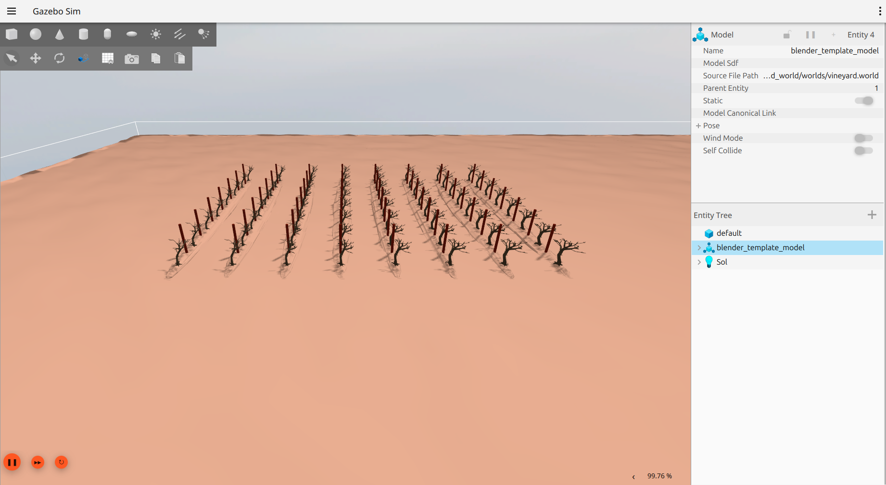

# robotnik_gazebo_worlds

**Description:** This repository contains different Gazebo worlds packaged for ROS 2 (Jazzy recommended) and Gazebo Harmonic.  
Each world is distributed as a standalone ROS 2 package, so you do **not** need to manually set `GZ_SIM_RESOURCE_PATH` or other environment variables—models are auto-discovered via env hooks.

## Dependencies

- Gazebo Harmonic (Ignition Gazebo)
- ROS 2 Jazzy (recommended)
- This repository is intended to be used with [robotnik_simulation](https://github.com/RobotnikAutomation/robotnik_simulation).


## General Installation

Clone the repository into your ROS 2 workspace:

```bash
git clone https://github.com/RobotnikAutomation/robotnik_gazebo_worlds.git
```

Build and source your workspace:

```bash
colcon build
source install/setup.bash
```

## Launch a World

For example, to launch the electrical substation world:

```bash
ros2 launch electrical_substation_world electrical_substation_world.launch.py
```


## Use These Worlds With Your Robot

Clone this repository into your robot's workspace, build, and source as above.

To launch your robot in a specific world, pass the world file as a parameter (example for ROS 2):

```bash
ros2 launch robotnik_gazebo_ignition spawn_world.launch.py world_path:=PATH_TO_FILE/robotnik_gazebo_worlds/electrical_substation_world/worlds/electrical_substation.world
```

## Create a New Gazebo World ROS 2 Package

> **Note:** **not yet been migrated** to ROS 2 Jazzy and Gazebo Harmonic.  

From the root of this repository, run the package creation script:

```bash
./create_world_pkg.sh demo_factory User user@robotnik.es
```

If you omit arguments, defaults will be used.

A new ROS 2 package with a basic world will be created:

```
├── demo_factory_world
│   ├── CMakeLists.txt
│   ├── launch
│   │   └── demo_factory_world.launch.py
│   ├── models
│   ├── package.xml
│   └── worlds
│       └── demo_factory.world
```

Add your models to the `models` folder.  
Open the world in Gazebo Harmonic using:

```bash
ros2 launch demo_factory_world demo_factory_world.launch.py
```

When Gazebo is ready, add your models and save the world inside the `worlds` folder.

## List of Worlds

### Electrical Substation

```bash
ros2 launch electrical_substation_world electrical_substation_world.launch.py
```


### Vineyard

```bash
ros2 launch vineyard_world vineyard_world.launch.py
```



### OPIL Factory

> **Note:** **not yet been migrated** to ROS 2 Jazzy and Gazebo Harmonic.  

**Note:** There is a wall at the origin. Spawn your robot at `x=4 y=4 z=0` to avoid collision.

```bash
ros2 launch opil_factory_world opil_factory_world.launch.py
```


### Rubber Factory

> **Note:** **not yet been migrated** to ROS 2 Jazzy and Gazebo Harmonic.  

```bash
ros2 launch rubber_factory_world rubber_factory_world.launch.py
```


### Warehouse

> **Note:** **not yet been migrated** to ROS 2 Jazzy and Gazebo Harmonic.  


Based on [warehouse_simulation_toolkit](https://github.com/wh200720041/warehouse_simulation_toolkit):

```bash
ros2 launch warehouse_world warehouse_world.launch.py
```


### Robotnik Lab

> **Note:** **not yet been migrated** to ROS 2 Jazzy and Gazebo Harmonic.  

```bash
ros2 launch robotnik_lab_world robotnik_lab_world.launch.py
```


### Photovoltaic Station

> **Note:** **not yet been migrated** to ROS 2 Jazzy and Gazebo Harmonic.  

```bash
ros2 launch photovoltaic_station_world photovoltaic_station_world.launch.py
```


## Compatibility

- ROS 2 Jazzy (recommended)
- Gazebo Harmonic (Ignition Gazebo)
- SDF 1.7 worlds and models
- Models auto-discovered via env hook (no manual path export needed)

## Troubleshooting

- **Missing mesh/model:** Check your install path under `install/<world_pkg>/share/<world_pkg>/models/...`
- **Warnings about `frame=""`:** Remove `frame=""` attributes from `<pose>` tags in SDF files.
- **Black textures:** Use power-of-two PNG images and prefer PBR `<metal>` workflow or classic OGRE script.
- **World not found:** Ensure you source `install/setup.bash` before launching.

## License

See LICENSE file in each package.

---