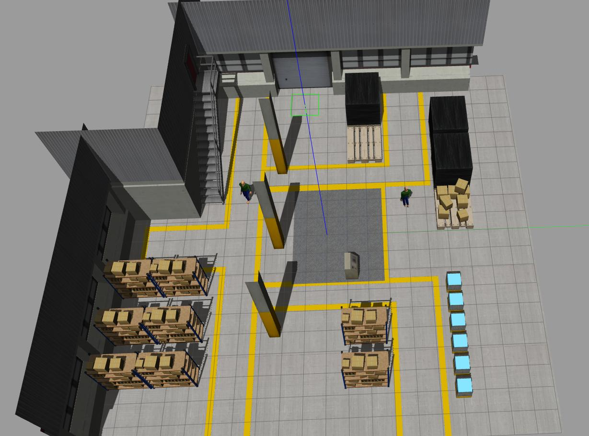
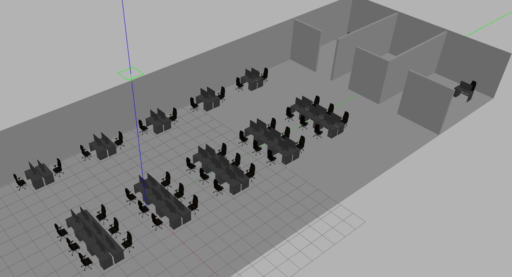

# robotnik_gazebo_worlds

**Description:** this package contains differents worlds for Gazebo embedded in ROS packages, so you don't need set the gazebo path or do other configurations. Each world has their own ROS package 

## General installation

In your workspace, clone the repository

```
$ git clone https://github.com/RobotnikAutomation/robotnik_gazebo_worlds.git
```

Build the workspace and source it:

```
$ catkin build
$ source devel/setup.bash
```

Launch a world, for example ```electrical_station.world```

```
$ roslaunch electrical_station_world electrical_station_world.launch
```


## Use these worlds with your robot

In the workspace of your robot, clone this repository

```
$ git clone https://github.com/RobotnikAutomation/robotnik_gazebo_worlds.git
```

Build the workspace and source it

```
$ catkin build
$ source devel/setup.bash
```

Launch your robot as always, but specify the name of the world. For example if you robot is a ```summit_xl``` working in ```melodic-devel``` branch, you must to do:

```
$ roslaunch summit_xl_sim_bringup summit_xl_complete.launch gazebo_world:=viesgo_electrical_station.world
```


## Create a new Gazebo world ROS package

Follow the general installation and go to the package

```
$ roscd robotnik_gazebo_worlds && cd ..
```

Execute the ```create_world_pkg.sh``` script. Add the name of the world, your name and your email. For example:

```
$ ./create_world_pkg.sh demo_factory User user@robotnik.es
```

If the name of the robot, the user, or the email is not set, default values will use.

If everything was well, a new ROS package with a basic world will create. This is the structure:

```
├── demo_factory_world
│   ├── CMakeLists.txt
│   ├── launch
│   │   └── demo_factory_world.launch
│   ├── models
│   ├── package.xml
│   └── worlds
│       └── demo_factory.world
```

Add your models into the ```models``` folder

Open the world using gazebo, in this case, run:

```
$ roslaunch demo_factory_world demo_factory_world.launch
```

When Gazebo is ready, add your models into the world. Then ```save as``` the world inside ```worlds``` folder


## List of worlds

### Electrical station

```
$ roslaunch electrical_station_world electrical_station_world.launch
```


### OPIL factory

**Note**: there is a wall at the origin of the world, spawn your robot on ```x=4 y=4 z=0``` to avoid the collision

```
$ roslaunch opil_factory_world opil_factory_world.launch
```


### Rubber factory

```
$ roslaunch rubber_factory_world rubber_factory_world.launch
```


### Warehose 

World based on the repository [warehouse_simulation_toolkit](https://github.com/wh200720041/warehouse_simulation_toolkit)
```
$ roslaunch warehouse_world warehouse_world.launch
```



### Robotnik Lab

```
$ roslaunch robotnik_lab_world robotnik_lab_world.launch
```

