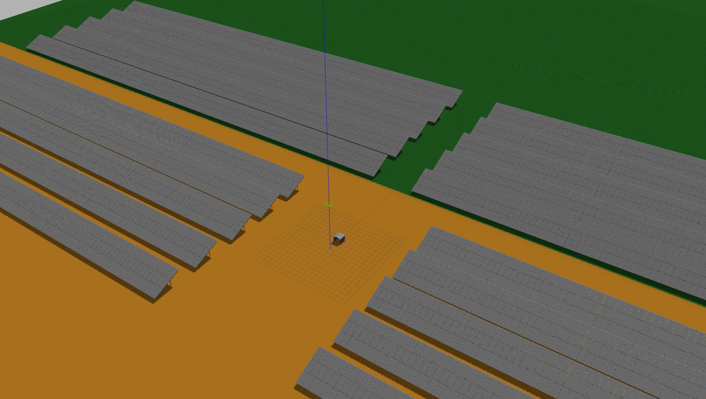

# photovoltaic_station_world

**Description:** This package contains a photovoltaic station world for Gazebo, integrated within a ROS package. No need to set the Gazebo path or perform additional configurations.



Photovoltaic station located in Cantabria, Spain.

## General installation

Clone the repository in your workspace:

```bash
git clone https://github.com/RobotnikAutomation/robotnik_gazebo_worlds/photovoltaic_station_world
```

Build the workspace and source it:

```bash
catkin build
source devel/setup.bash
```

Launch the package to view the photovoltaic station world:

```bash
roslaunch photovoltaic_station_world photovoltaic_station_world.launch
```

## Use this map with your robot

In your robot's workspace, clone this repository:

```bash
git clone https://github.com/RobotnikAutomation/robotnik_gazebo_worlds/photovoltaic_station_world
```

Build the workspace and source it:

```bash
catkin build
source devel/setup.bash
```
